<div align="center">

# AI Draw.io Agent

**面向可控执行、交互式绘图与运行治理的多 Agent 工作台**

基于 Google ADK Java、Spring Boot、React 与 Draw.io 构建，覆盖需求审批、流式执行、图表编辑、运行监控与 Agent 评测的完整链路。


</div>

## 项目简介

AI Draw.io Agent 不是单一的“文本生成图表”示例，而是一套可运行的 Agent 应用工程。系统通过 YAML 装配通用任务、Draw.io 和 PPT Agent，并围绕真实 Agent 工作流实现持久化会话、人工审批、能力按需加载、动态模型路由、上下文压缩、运行追踪和自动化评测。

当前版本已经打通前后端核心链路，适合用于学习 Google ADK Java、研究 Agent 工程化方案，或作为多 Agent 应用的扩展基础。

> [!IMPORTANT]
> 当前项目处于“功能集成完成、生产验收未完成”阶段。系统目前使用部署在自建服务器上的 PostgreSQL 与 Redis；仓库中的默认账号和开发配置仅用于演示，生产环境必须使用独立凭据与密钥管理方案。

## 核心能力

| 能力域 | 已实现功能 |
| --- | --- |
| 多 Agent 工作台 | YAML 配置驱动装配；内置通用任务、Draw.io、PPT Agent；支持串行工作流与运行时 Subagent |
| 交互式绘图 | 需求分析、方案审批、Draw.io 节点与连线增量生成、嵌入式编辑，以及 `.drawio`、SVG、PNG 导出 |
| 可靠流式执行 | 创建持久化 Run 后通过 SSE 订阅事件；支持事件序号、`Last-Event-ID` 续传和页面重连恢复 |
| Human-in-the-loop | 基于持久化 Checkpoint 的方案确认、修改、暂停、继续、取消，以及高风险工具审批 |
| 会话与工作区 | JWT Access Token、HttpOnly Refresh Cookie、会话历史、多工作区及 `OWNER` / `EDITOR` / `VIEWER` 权限 |
| 动态能力治理 | Tool / Skill Catalog 检索、按需加载、执行快照白名单、风险控制、超时、熔断、并发限制与大结果制品化 |
| 动态模型路由 | 模型目录、任务需求分析、硬约束过滤、Fast / Balanced / Reasoning 分层及最低成本充分模型选择 |
| 上下文工程 | ADK 会话级摘要、请求级压缩、近期对话窗口、Draw.io 结构化状态和大型 Tool Result 摘要 |
| 动态 Subagent | 数据库模板驱动的受控创建、异步执行、DAG 依赖、深度/并发/任务数/Token 预算约束 |
| 运行可观测性 | Task、Invocation、Agent、Model、Tool、Capability 与压缩记录；支持统计概览和统一瀑布调用链 |
| Agent Eval | Dataset / Case 管理、内容与轨迹评分、Hard Gate、预算校验、Baseline 回归比较及 Invocation 反查 |
| 长期记忆 | 用户偏好、项目事实、情节、流程和任务经验的创建、检索、确认、编辑、证据追溯与归并 |
| Artifact 版本管理 | Draw.io 与大型工具结果持久化，支持 Lineage、版本 Diff、分支和回滚 |

### Draw.io 执行流程

1. `agent_analyst` 将自然语言需求整理为结构化绘图方案。
2. 用户在工作台中确认方案，或提交修改意见。
3. `agent_drawer` 在审批通过后按需加载 Draw.io Skill，逐步生成节点、连线和完整 XML。
4. 前端实时更新执行进度与画布，用户可继续编辑并导出图表。

未通过审批的请求不会进入绘图执行阶段，高风险工具也需要单独授权。

## 系统架构

```mermaid
flowchart LR
    U[浏览器] --> F[React 工作台]
    F -->|REST / SSE| T[Trigger 接口层]
    T --> D[Domain 领域层]
    D --> A[Google ADK Runner]
    A --> R[Agent / Workflow]
    R --> C[Capability Broker]
    C --> S[Skills]
    C --> M[MCP / Function Tools]
    A --> L[OpenAI-compatible Models]
    D --> I[Infrastructure 基础设施层]
    I --> P[(云端 PostgreSQL)]
    I --> E[(云端 Redis)]
    F --> X[Draw.io Embed]
```



核心设计：

- Spring Boot 负责 Web 容器、配置与依赖注入，Agent、Runner、Session、Plugin、Skill 和 MCP 运行链路由 Google ADK 承载。
- PostgreSQL 是用户、会话、消息、Checkpoint、Artifact、Memory、Eval 和运行观测数据的事实源。
- Redis 承载 Refresh/JWT 治理、并发协调和可重建的短期缓存，不作为长期数据的唯一存储。
- Agent 通过 Capability Broker 检索、加载和执行能力，具体 Tool / Skill 不会无边界地全部注入模型上下文。

## 技术栈

### 后端

- Java 17、Spring Boot 4.0.2、Maven
- Google ADK Java 1.7.0
- OpenAI-compatible Chat Completions API
- PostgreSQL 15、Flyway、JDBC
- Redis 7.2
- JWT 双 Token 认证

### 前端

- React 19、TypeScript、Vite
- React Router、TanStack Query、Zustand
- Tailwind CSS 4
- `react-drawio` / Draw.io Embed
- Vitest、Testing Library、ESLint

## 工程结构

```text
draw-io-agent/
├── ai-agent-scaffold-draw-io-api/             # 对外接口与 DTO
├── ai-agent-scaffold-draw-io-app/             # 应用入口、配置、资源与数据库迁移
├── ai-agent-scaffold-draw-io-domain/          # Agent、路由、治理、记忆、评测等领域逻辑
├── ai-agent-scaffold-draw-io-infrastructure/  # PostgreSQL、Redis、ADK Session 等基础设施实现
├── ai-agent-scaffold-draw-io-trigger/         # REST、SSE、认证与恢复任务入口
├── ai-agent-scaffold-draw-io-types/           # 公共类型、异常与基础组件
├── front/                                     # React 工作台
├── docs/                                      # 架构、功能实现与部署资料
└── pom.xml                                    # Maven 聚合工程
```

后端采用分层模块组织依赖，前端按 `shared → features → pages → app` 的方向组合能力。

## 快速开始

### 1. 环境要求

- JDK 17
- Maven 3.9+
- Node.js 20.19+ 或 22.12+
- Corepack / pnpm 10
- 可访问的 PostgreSQL 15 与 Redis 7 服务
- 至少一个可用的 OpenAI-compatible 模型服务

Draw.io 默认加载 `https://embed.diagrams.net`，绘图画布需要能够访问该地址；受限网络环境可配置自托管 Draw.io。

### 2. 准备云端基础设施

当前项目使用自建服务器上的 PostgreSQL 与 Redis。启动应用前，请确保：

- PostgreSQL 已创建业务数据库和专用账号，应用节点可访问数据库端口；
- 数据库账号拥有执行项目 Flyway Migration 所需的建表、索引和扩展权限；
- Redis 已开启持久化与访问认证，并只对可信网络开放；
- 防火墙或安全组仅允许应用节点访问 PostgreSQL、Redis，不应直接暴露到公网；
- 已准备数据库备份、恢复与凭据轮换策略。

首次启动时，Flyway 会自动创建并升级项目所需的数据库结构。

### 3. 配置并启动后端

所有服务地址与凭据均通过环境变量注入。下面是 PowerShell 示例，请替换其中的占位符：

```powershell
$env:DB_URL='jdbc:postgresql://<postgres-host>:5432/agent_platform'
$env:DB_USERNAME='<postgres-username>'
$env:DB_PASSWORD='<postgres-password>'
$env:REDIS_HOST='<redis-host>'
$env:REDIS_PORT='6379'
$env:REDIS_PASSWORD='<redis-password>'
$env:JWT_SECRET='<at-least-32-random-characters>'

$env:DEEPSEEK_BASE_URL='https://api.deepseek.com/v1'
$env:DEEPSEEK_API_KEY='<your-api-key>'
$env:DEEPSEEK_MODEL='deepseek-chat'

mvn clean package -DskipTests
java -jar ai-agent-scaffold-draw-io-app\target\ai-agent-scaffold-draw-io-app.jar
```

后端默认监听 `http://127.0.0.1:8091`。

项目还支持 Qwen、GLM、Kimi 等 OpenAI-compatible Provider，可通过 `QWEN_*`、`GLM_*`、`KIMI_*` 环境变量配置。具体模型能力元数据位于 [`model-catalog.yml`](ai-agent-scaffold-draw-io-app/src/main/resources/model-catalog.yml)。

> [!CAUTION]
> 不要将服务器地址、API Key、数据库密码、Redis 密码或 JWT Secret 提交到 Git。仓库历史中若曾出现有效凭据，应在对应服务端撤销并轮换；仅删除文件不能消除泄露风险。

### 4. 启动前端

打开新的终端窗口：

```powershell
cd front
corepack pnpm install
corepack pnpm dev
```

访问 `http://127.0.0.1:5173`。Vite 默认将 `/api` 代理到 `http://127.0.0.1:8091`。

数据库首次迁移会创建本地演示管理员：

```text
用户名：admin
密码：admin
```

该账号仅用于开发演示，部署后应立即修改或禁用。

### 5. 功能入口

| 路径 | 页面 |
| --- | --- |
| `/workspace` | Agent 对话、审批与 Draw.io 工作区 |
| `/workspaces` | 工作区及成员权限管理 |
| `/monitor` | 运行概览、Invocation 明细与瀑布调用链 |
| `/eval` | Agent 数据集、用例、运行与 Baseline 管理 |
| `/memories` | 长期记忆检索与维护 |

## 配置说明

### 常用后端环境变量

| 变量 | 是否必需 | 说明 |
| --- | --- | --- |
| `DB_URL` | 是 | 云端 PostgreSQL JDBC 地址 |
| `DB_USERNAME` / `DB_PASSWORD` | 是 | PostgreSQL 专用账号与密码 |
| `REDIS_HOST` / `REDIS_PORT` | 是 | 云端 Redis 地址与端口 |
| `REDIS_PASSWORD` | 按服务配置 | Redis 访问密码 |
| `JWT_SECRET` | 是 | JWT 签名密钥，至少 32 位随机字符串 |
| `DEEPSEEK_BASE_URL` | 按 Provider | OpenAI-compatible API 根地址 |
| `DEEPSEEK_API_KEY` | 按 Provider | 模型服务访问密钥 |
| `DEEPSEEK_MODEL` | 否 | 通用 Agent 默认模型 ID |
| `MODEL_DYNAMIC_ROUTING_ENABLED` | 否 | 是否启用动态模型路由，默认 `true` |
| `AGENT_PERSISTENCE_MODE` | 否 | Agent 运行状态存储方式，默认 `postgres` |

完整运行参数可在 [`application-dev.yml`](ai-agent-scaffold-draw-io-app/src/main/resources/application-dev.yml) 与各 Agent YAML 中查看。

### 前端环境变量

```powershell
cd front
Copy-Item .env.example .env.local
```

| 变量 | 默认值 | 说明 |
| --- | --- | --- |
| `VITE_API_BASE_URL` | 空 | API 前缀；开发环境留空以使用同源代理 |
| `VITE_API_PROXY_TARGET` | `http://127.0.0.1:8091` | Vite 开发代理目标 |
| `VITE_DRAWIO_BASE_URL` | `https://embed.diagrams.net` | Draw.io Embed 地址 |

前端环境文件中也不应保存模型 API Key。

## 构建与测试

后端测试与打包：

```powershell
mvn test
mvn package -DskipTests
```

前端质量检查与构建：

```powershell
cd front
corepack pnpm typecheck
corepack pnpm lint
corepack pnpm test
corepack pnpm build
```

前端构建产物位于 `front/dist/`。部署时可参考 [`nginx.conf.example`](front/nginx.conf.example) 配置 SPA fallback、API 反向代理与 SSE 长连接。

## 关键设计

### 能力按需检索

Agent 固定获得 `search_capabilities`、`load_capability` 和 `execute_capability` 三类入口。系统先进行权限与类型过滤，再按元数据相关性排序；加载和执行只能发生在当前 Invocation 绑定的快照范围内，从而减少无关 Tool Schema 的上下文占用，并为实际能力调用保留审计记录。

### 动态模型路由

用户显式选择模型时优先使用该模型；自动模式先检查上下文窗口、输出限制、Vision、Tool Calling 等硬约束，再按任务要求从 Fast、Balanced、Reasoning 层级中选择成本较低且能力充分的候选。路由候选、得分依据与最终选择会进入运行观测和离线评测记录。

### 上下文与恢复

系统同时使用 ADK 事件摘要和请求级压缩：稳定指令与能力入口不参与裁剪，旧对话进入摘要，近期交互保持原文，Draw.io XML 被提取为结构化项目状态，大型 Tool Result 转存为 Artifact。运行状态、事件日志与 Checkpoint 持久化后，可支持断线重连和后台恢复调度。

## 可选：本地基础设施

如需在隔离开发环境中临时运行 PostgreSQL 与 Redis，仓库保留了 Docker Compose 示例：

```powershell
docker compose -f docs/dev-ops/docker-compose.yml up -d
```

该配置不是当前项目默认的基础设施连接方式，使用后仍需通过 `DB_*` 与 `REDIS_*` 环境变量显式切换到本地服务。

## 项目文档

- [系统全功能分析与实现架构总览](docs/功能实现/系统全功能分析与实现架构总览.md)
- [Checkpoint 与 Human-in-the-loop 功能实现](docs/功能实现/Checkpoint与Human-in-the-loop功能实现.md)
- [动态 Tools / Skills 按需检索、加载与执行](docs/功能实现/动态Tools-Skills按需检索加载与执行.md)
- [上下文工程与四层上下文模型](docs/功能实现/上下文工程与压缩四层上下文模型.md)
- [Agent 运行时监控平台功能实现](docs/功能实现/Agent运行时监控平台功能实现.md)
- [模型动态路由方案调研](docs/功能实现/模型动态路由先进方案调研.md)
- [前端开发与部署说明](front/README.md)

## 当前边界

- PPT Agent 已完成后端装配与结构化内容生成流程，但当前前端工作台尚未提供 PPT 可视化渲染与文件导出。
- Draw.io 默认依赖公网 Embed 服务，离线环境需要自行部署并配置 Draw.io。
- Capability Snapshot 当前包含单机内存状态，多实例生产部署前仍需完成跨实例共享与恢复验证。
- Tool 自动重试受幂等性约束，不应对未声明为幂等的写操作盲目重试。
- 真实 Provider、长上下文、权限隔离、故障恢复与多实例场景仍需在目标部署环境完成验收。
- 生产环境还需要完善 TLS、限流、正式密钥管理、数据库备份和审计保留策略。

## 参与开发

提交变更前，请完成与改动范围对应的后端测试，或前端 `typecheck`、`lint`、`test`、`build`。新增 Agent、Tool 或 Skill 时，应同步补充权限边界、失败行为、观测字段和测试用例，避免将未经治理的能力直接暴露给模型。
