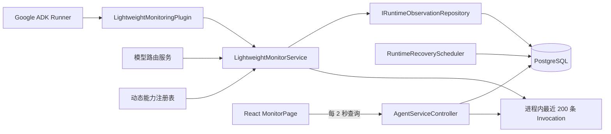
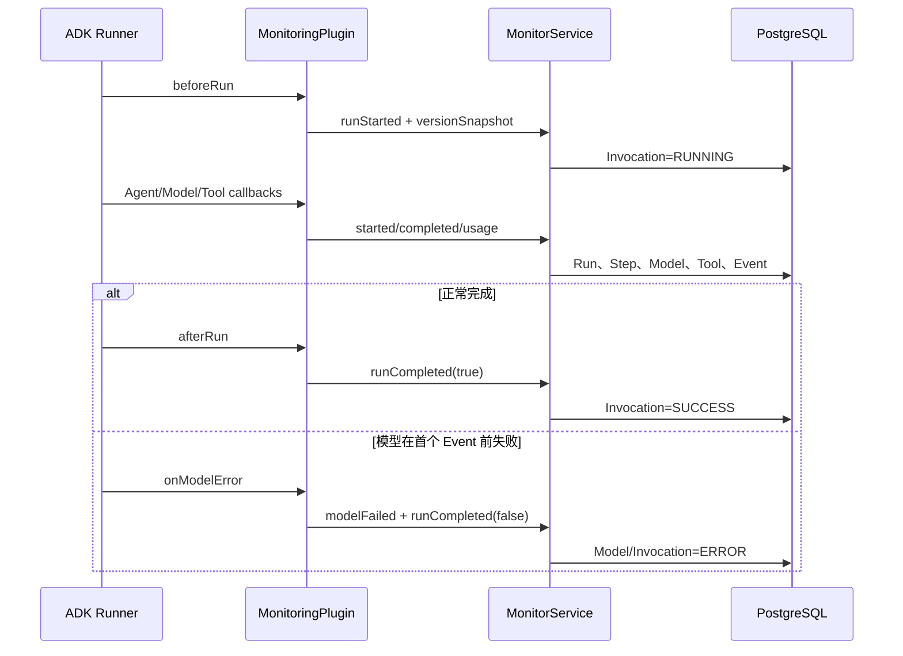

# Agent 运行时监控平台功能实现

> 文档日期：2026-08-29
>
> 实现范围：当前仓库中的本地 Agent 运行观测、PostgreSQL 持久化、查询接口和 React 监控页面
>
> 关联调研：[Agent运行时监控平台市场调研.md](./Agent运行时监控平台市场调研.md)

## 1. 功能定位

本项目已经实现一套应用内 Agent 运行时监控平台，用于回答以下问题：

- 某个 Workflow 当前处于运行、等待人工审批、成功还是失败状态；
- 一次业务任务经历了多少次 Invocation，每次由哪些 Agent、模型和 Tool 参与；
- Agent、模型、Tool、动态能力检索分别耗时多久，父子调用关系是什么；
- 模型消耗了多少输入/输出 Token，按配置单价估算了多少费用；
- 动态模型路由为什么选择某个模型，命中了哪些特征；
- 动态 Tools/Skills 检索返回了哪些候选，最终加载或执行了哪一个；
- Tool 是否重试、是否失败、是否产生了大结果 Artifact；
- Context 是否发生压缩，Workflow 在人工审批和恢复队列中等待了多久；
- Eval 结果、Artifact 版本和动态 Subagent 如何关联回原始调用。

当前方案是**本地轻量级观测平台**，不是独立部署的 APM。数据直接由 Agent 运行时采集并写入 PostgreSQL，前端通过业务 API 查询；暂未接入 OpenTelemetry Collector、Langfuse、Phoenix、Datadog 或告警系统。

---

## 2. 核心观测层级

平台使用以下层级组织一次 Agent 业务执行：

```text
Workflow / AgentTask             一次可暂停、审批、恢复的完整业务任务
└── Invocation                   一次 ADK Runner 调用；恢复或审批后可产生新的 Invocation
    ├── AgentRun                 根 Agent 或 Subagent 的一次运行
    │   ├── ModelCall            一次模型请求
    │   └── ToolExecution        一次 Tool/MCP/Skills 入口调用
    │       └── ToolAttempt      首次执行及每次重试
    ├── CapabilitySearch         动态能力检索及候选排名
    ├── CapabilityExecution      能力 LOAD/EXECUTE 过程
    ├── AgentRunStep             按 Invocation 排序的统一执行步骤
    └── RuntimeEvent             路由、压缩、生命周期等事件日志
```

其中：

- `Workflow` 是用户视角的完整任务，可跨多个 Invocation；
- `Invocation` 是一次运行时执行单元，也是详情页和统一瀑布图的查询主键；
- `AgentRun` 通过 `parent_run_id` 和 `branch_path` 表达串行、并行及 Subagent 父子关系；
- `RuntimeEvent` 保存不适合拆成独立表的运行事件，例如模型路由决策和上下文压缩记录。

---

## 3. 总体架构



主要模块职责：

| 模块 | 职责 |
|---|---|
| `LightweightMonitoringPlugin` | 接入 ADK 生命周期回调，采集 Run、Agent、Model、Tool 和 Event |
| `LightweightMonitorService` | 维护实时内存快照、Token 口径、调用关联、脱敏，并统一调用持久化端口 |
| `IRuntimeObservationRepository` | 定义观测数据写入和查询边界 |
| `JdbcRuntimeObservationRepository` | 将观测数据写入 PostgreSQL，并完成汇总、详情、瀑布和 Workflow 查询 |
| `InvocationVersionCatalog` | 为 Prompt、Agent 配置和模型生成短版本指纹 |
| `RuntimeRecoveryScheduler` | 心跳、超时检测、僵尸运行收口和 Workflow 恢复任务入队 |
| `AgentServiceController` | 提供监控 API，合并实时内存态与持久化态 |
| `MonitorPage` | 展示指标、调用列表、Workflow 汇总和完整调用详情 |

---

## 4. 运行时采集实现

### 4.1 ADK 插件接入

Agent 配置在 `runner.plugin-name-list` 中注册 `lightweightMonitoringPlugin`。插件继承 ADK `BasePlugin`，不要求业务 Agent 手工埋点主要生命周期：

| ADK 回调 | 监控动作 | 主要落库对象 |
|---|---|---|
| `beforeRunCallback` | 创建 Invocation，并保存版本快照 | `agent_invocation`、`agent_runtime_event` |
| `afterRunCallback` | 等待动态 Subagent 短暂收口后完成 Invocation | `agent_invocation` |
| `beforeAgentCallback` | 创建 AgentRun，解析父 Run 与并行分支 | `agent_run`、`agent_run_step` |
| `afterAgentCallback` | 完成 AgentRun，汇总模型次数和 Token | `agent_run`、`agent_run_step` |
| `beforeModelCallback` | 创建 ModelCall，并写入输入 Token 估算值 | `model_call`、`agent_run_step` |
| `afterModelCallback` | 读取 Provider Usage，完成 ModelCall | `model_call` |
| `onModelErrorCallback` | 记录模型错误并主动关闭 Invocation | `model_call`、`agent_invocation` |
| `beforeToolCallback` | 创建 ToolExecution，保存脱敏参数和治理策略 | `tool_execution`、`tool_execution_attempt` |
| `afterToolCallback` | 保存结果摘要；大结果转为 Artifact | `tool_execution`、`artifact` |
| `onToolErrorCallback` | 标记 Tool 失败 | `tool_execution` |
| `onEventCallback` | 累加事件数并记录 Context 压缩 | `agent_runtime_event` |

模型路由与动态能力检索不属于通用 ADK 回调，因此由对应服务直接调用 `LightweightMonitorService.modelRouted`、`capabilitySearch`、`capabilityStarted` 和 `capabilityCompleted`。

### 4.2 Invocation 生命周期



`runCompleted` 在内存侧和数据库侧均具有幂等保护：已完成的记录不会被晚到的回调反向覆盖。数据库仅更新仍为 `RUNNING` 的 Invocation，恢复调度器已经写入的 `INTERRUPTED` 或 `FAILED` 不会被迟到的响应改回 `SUCCESS`。

### 4.3 父子 Run 与并行分支关联

`LightweightMonitorService` 使用 `(invocationId, branch, agentName)` 作为活动 Run 键，而不是查询“数据库中最后一条 Run”。这保证并行分支不会争用同一个父节点。

关联优先级为：

1. 回调上下文显式传入的 `forcedParentRunId`；
2. 同 Invocation、父 Agent、同分支的活动 Run；
3. 同 Invocation、同 Agent 的最新活动 Run。

最终 `agent_run.parent_run_id` 形成调用树，`branch_path` 保留 ADK 分支信息，前端据此展示根 Agent、Subagent 和统一瀑布层级。

### 4.4 模型路由追踪

每次动态路由记录：

- Agent 名称、最终模型、选择原因和时间；
- 复杂度等级及是否由用户显式指定；
- 当前用户消息长度、上下文长度、推理分等量化指标；
- 命中特征词；
- 各级路由策略的 `HIT`、`PASSED` 等决策轨迹；
- 面向页面展示的路由摘要。

路由记录作为 `MODEL_ROUTED` RuntimeEvent 持久化，详情查询时还原为 `modelDecisions`。选定模型同时更新 Invocation 的模型版本指纹。

### 4.5 动态能力追踪与反馈

动态 Tools/Skills 采用“检索”和“执行”分表记录：

- `capability_search`：查询文本、请求类型、注册表大小、候选数量和耗时；
- `capability_search_candidate`：排名、分数、能力类型/分组/版本/风险级别及是否被选中；
- `capability_execution`：`LOAD` 或 `EXECUTE`、参数、资源路径、结果摘要、字节数、SHA-256、Artifact 和状态；
- `capability_feedback`：用户对候选的有效/不匹配判断和可选备注。

能力开始执行时，系统会把对应候选更新为 `selected=true`。页面提供“有效”和“不匹配”反馈按钮，当前前端分别提交 `NO_IMPACT` 和 `WRONG_SELECTION`。

### 4.6 Tool 治理与大结果处理

Tool 调用保存当次治理快照，包括风险级别、超时、最大重试、是否要求审批和最大结果字节数。`(invocation_id, tool_call_id)` 唯一约束避免同一 Tool Call 重复执行记录；重放会写入 `TOOL_REPLAYED` 事件。

每次重试单独写入 `tool_execution_attempt`。Tool 完成时：

1. 锁定对应 `tool_execution`，非 `RUNNING` 记录直接返回已有结果；
2. 保存最长 1000 字符的结果摘要；
3. 结果超过治理阈值时，完整的脱敏后结果写成 `TOOL_RESULT` Artifact；
4. Tool 返回给 Agent 的内容改为摘要和 `artifactId`，避免大结果继续占用模型上下文；
5. Capability 执行记录同步关联该 Artifact。

---

## 5. Token、耗时和费用口径

### 5.1 Token 统计

Token 优先使用模型 Provider 返回的 Usage：

- `promptTokenCount` → 输入 Token；
- `candidatesTokenCount` → 输出 Token；
- `totalTokenCount` → 总 Token。

Provider 未返回 Usage 时，使用字符串长度除以 4 的轻量估算，并在实时详情中标记 `tokensEstimated=true`。同一个 Agent 第一次收到真实 Usage 后，会清除已有估算值再累计真实值，避免“估算 + 真实值”重复计算。

多次模型调用按以下口径保存：

- `model_call` 保存**单次调用增量**；
- `agent_run` 和 `agent_invocation` 保存累计值；
- 每次 `modelStarted` 都清零本次调用计数器，失败调用不会复用上一次的 Token。

### 5.2 时间指标

| 指标 | 计算方式 |
|---|---|
| Invocation 耗时 | `completed_at - started_at`；运行中使用当前时间 |
| 平均耗时 | 时间窗口内所有终态 Invocation 的 `duration_ms` 平均值 |
| P95 耗时 | PostgreSQL `percentile_cont(0.95)`，仅统计终态 Invocation |
| Workflow 总耗时 | Task 创建至完成；未完成时计算到当前时间 |
| Workflow 实际执行 | 所属 Invocation 的 `duration_ms` 之和 |
| 模型/Tool 耗时 | 所属 `model_call` / `tool_execution` 耗时之和 |
| 人工等待 | 状态进入 `WAITING_APPROVAL` 或 `WAITING_TOOL_APPROVAL` 至下一次状态变更 |
| 队列等待 | `workflow_recovery_job.created_at` 至 `claimed_at` |

这些指标含义不同，可能重叠。例如并行模型调用的耗时之和可能大于墙钟时间，不能用各子项简单相加还原 Workflow 总耗时。

### 5.3 成功率与时间窗口

汇总接口只接受 `1`、`24`、`168` 小时，其他值回退到 24 小时。

```text
successRate = SUCCESS / (SUCCESS + ERROR + FAILED + INTERRUPTED)
```

`RUNNING` 不进入成功率分母。为避免长任务从监控页消失，开始时间早于窗口但仍为 `RUNNING` 的 Invocation 仍计入总调用和运行中数量。

### 5.4 费用估算

单次模型费用为：

```text
inputTokens × input-per-million / 1,000,000
+ outputTokens × output-per-million / 1,000,000
```

配置项：

```yaml
ai.agent.model-pricing.input-per-million
ai.agent.model-pricing.output-per-million
```

默认值均为 `0`。未配置时页面显示“未配置单价”，不会展示伪精确金额。当前实现使用应用级统一单价，不是按模型目录分别计价。

---

## 6. 持久化模型

监控核心表及用途如下：

| 表 | 用途 |
|---|---|
| `agent_task` | Workflow 业务任务及当前 Invocation/Checkpoint |
| `agent_invocation` | 一次运行的状态、耗时、Token、费用、重试和版本快照 |
| `agent_run` | Agent/Subagent 父子运行树 |
| `agent_run_step` | Invocation 内统一排序的 Agent、Model、Tool 步骤 |
| `model_call` | 单次模型调用、Token、耗时、费用和错误 |
| `tool_execution` | Tool 参数摘要、治理策略、结果、重试及 Artifact |
| `tool_execution_attempt` | 每次 Tool 尝试 |
| `agent_runtime_event` | 生命周期、模型路由、上下文压缩和能力事件 |
| `capability_search` / `capability_search_candidate` | 动态能力检索及候选排名 |
| `capability_execution` | 能力加载/执行结果 |
| `capability_feedback` | 用户对能力选择的反馈 |
| `workflow_state_transition` | Workflow 状态变更时间线 |
| `runtime_instance` | 应用实例心跳 |
| `workflow_recovery_job` | 中断 Workflow 的恢复队列 |
| `artifact` | 图表、Agent 输出和外置的大 Tool 结果 |

`agent_runtime_event` 的 `sequence_no` 按 Session 递增。写入事件和执行步骤时使用 PostgreSQL advisory transaction lock，避免并发分支生成重复序号。

版本追踪使用 SHA-256 前 16 位保存：

- `prompt_version`：Agent Prompt 配置指纹；
- `agent_config_version`：完整 Agent 配置指纹；
- `model_version`：模型及 Provider 端点配置指纹；
- Capability 额外保存 `schema_version` 与 `content_version`。

这些是可比较的配置指纹，不代表模型供应商官方发布版本。

---

## 7. 实时态与持久化态合并

`LightweightMonitorService` 最多保留当前进程最近 200 条 Invocation，用于正在执行或数据库写入稍有延迟时的实时展示。历史事实仍以 PostgreSQL 为准。

列表接口按 Invocation ID 合并两类数据：

- 实时记录优先保留当前运行信息；
- 持久化数据补齐 `taskId` 和有效的 `workflowName`；
- 如果实时状态仍非终态而数据库已经是终态，以数据库终态、完成时间、耗时和错误为准；
- 如果实时状态已经终态而数据库仍是过期的 `RUNNING`，不降级实时状态；
- 仅存在于任一数据源的记录仍会返回。

详情接口先查询持久化结构、AgentRun、瀑布、Subagent、Capability 和 Eval，再用实时详情覆盖通用字段；持久化的 Model、Tool 和 RuntimeEvent 列表优先保留，以保证结构完整。

持久化写入采用旁路容错：观测库写入异常会记录 Warning，但不阻断 Agent 主流程。这意味着极端数据库故障期间可能只有进程内临时观测数据。

---

## 8. 查询 API

所有接口位于 `/api/v1` 下，并使用当前登录用户做数据归属校验。

| 方法与路径 | 功能 |
|---|---|
| `GET /monitor/summary?sessionId=&hours=` | 查询 1h/24h/7d 汇总指标，可按 Session 过滤 |
| `GET /monitor/invocations` | 查询最近 200 条 Invocation，并合并实时态 |
| `GET /monitor/invocations/{invocationId}` | 查询单次调用完整详情 |
| `GET /monitor/sessions/{sessionId}/invocations` | 查询某 Session 的 Invocation |
| `GET /monitor/workflows/{taskId}` | 查询跨 Invocation 的 Workflow 汇总 |
| `POST /monitor/invocations/{invocationId}/capability-feedback` | 提交能力候选反馈 |

`GET /monitor/invocations/{invocationId}` 返回的主要结构包括：

```json
{
  "task": {},
  "steps": [],
  "agentRuns": [],
  "waterfall": [],
  "subagentTasks": [],
  "agents": [],
  "models": [],
  "modelDecisions": [],
  "tools": [],
  "capabilitySearches": [],
  "capabilityExecutions": [],
  "compressions": [],
  "events": [],
  "evaluations": []
}
```

Repository 查询在返回详情、瀑布、能力链路或写入反馈前校验 Invocation 是否属于当前用户。Workflow 和 Session 查询同样通过用户关联表约束数据范围。

---

## 9. 前端监控功能

页面路由为 `/monitor`，工作台“运行监控”按钮会在新标签页打开。页面使用 TanStack Query 每 2 秒刷新汇总、调用列表、详情和 Workflow 数据。

### 9.1 顶部指标

支持全部 Session 或指定 Session，并可选择 1 小时、24 小时、7 天窗口。展示：

- 总调用、运行中、成功/异常、成功率；
- 平均耗时、P95 耗时；
- 总 Token、输入 Token、输出 Token；
- 估算费用。

### 9.2 Workflow / Invocation 列表

左侧按 `taskId` 聚合 Invocation；没有 Task 时退化为按 Invocation 自身分组。每项展示根 Agent、状态、耗时、Agent/Tool/Event 数量，列表可折叠。

### 9.3 调用详情

右侧按以下顺序展示：

1. Invocation 元信息与 Token 是否为估算值；
2. Workflow 总耗时、实际执行、人工等待、队列等待、费用、Artifact 和状态时间线；
3. Eval 关联链接；
4. AgentTask 状态；
5. Agent/Model/Tool/Capability 统一瀑布图；
6. 动态 Subagent 任务和 AgentRun；
7. 持久化执行步骤与 Agent 生命周期；
8. 模型调用及动态路由依据；
9. 动态能力候选、执行结果和人工反馈；
10. Tools/MCP/Skills 调用及重试；
11. Context 压缩记录。

统一瀑布图把 `agent_run`、`model_call`、`tool_execution`、`capability_search` 和 `capability_execution` 合并后按开始时间展示。横轴以本次 Invocation 的最早开始和最晚完成时间归一化，父节点决定缩进层级；仍在运行的项目以当前时间计算宽度。

---

## 10. 可靠性、安全与恢复

### 10.1 错误收口

- 模型可能在产生首个 ADK Event 前失败，此时 `onModelErrorCallback` 主动完成 Model 和 Invocation；
- Invocation 完成时会强制收口仍在运行的 Agent、Step、Model 和 Tool；
- 数据库更新带状态条件，晚到回调不能覆盖恢复调度器写入的终态；
- Tool 完成使用事务和行锁，重复完成返回已有 Artifact，不重复写结果。

### 10.2 实例心跳与僵尸任务恢复

每个进程生成唯一 `instanceId`。按当前开发环境默认配置：

- 每 10 秒更新 `runtime_instance` 和本实例运行中 Invocation 的心跳；
- 每 15 秒扫描僵尸 Invocation 和超时 Tool；
- 心跳超过 60 秒未更新时，将 Invocation 标为 `INTERRUPTED`；
- 扫描到其他实例的 Invocation 运行超过 15 分钟时标为 `FAILED`；
- Tool 默认超过 5 分钟标为 `FAILED`；
- 存在可恢复且仍为 `RUNNING` 的 Checkpoint 时，创建唯一 `workflow_recovery_job` 并将 Checkpoint 暂停，交给恢复 Worker；
- 进程正常退出时将实例标为 `STOPPED`。

以上时长均可通过 `ai.agent.recovery.*` 环境变量配置覆盖。

### 10.3 敏感信息处理

进入观测存储前会递归脱敏以下键名或文本字段：

```text
password, passwd, secret, token, api_key/api-key, authorization, cookie
```

Tool 参数、Tool 结果、Capability 参数/结果、模型错误和 RuntimeEvent Payload 都经过脱敏；字符串还会截断，避免无界写入。Capability 结果的大小和 SHA-256 基于原始序列化结果计算，因此不需要保存完整敏感内容也能进行大小分析和一致性核对。

脱敏是应用层的基础防线，不等同于完整 DLP。新的敏感字段命名、自然语言密钥或二进制内容仍需额外治理。

---

## 11. 配置与使用

监控插件已经在 Draw.io、PPT 和 General Agent 的 Runner 配置中启用。启动应用和前端后：

1. 在工作台发起 Agent 请求；
2. 打开 `/monitor`；
3. 选择时间窗口和 Session；
4. 选择 Invocation 查看完整 Trace；
5. 在“能力决策链”中对候选提交反馈；
6. 需要质量回归时通过页面链接进入 Agent Eval。

关键配置：

| 配置 | 默认值 | 作用 |
|---|---:|---|
| `ai.agent.model-pricing.input-per-million` | `0` | 每百万输入 Token 单价 |
| `ai.agent.model-pricing.output-per-million` | `0` | 每百万输出 Token 单价 |
| `ai.agent.recovery.heartbeat-ms` | `10000` | 实例心跳周期 |
| `ai.agent.recovery.scan-ms` | `15000` | 异常扫描周期 |
| `ai.agent.recovery.stale-ms` | `60000` | 心跳过期阈值 |
| `ai.agent.recovery.invocation-timeout-ms` | `900000` | Invocation 超时阈值 |
| `ai.agent.recovery.tool-timeout-ms` | `300000` | Tool 超时阈值 |

数据库结构由 Flyway `V1`、`V4`、`V6`、`V9` 至 `V12`、`V18` 和 `V19` 等迁移共同维护，部署时必须按顺序执行完整迁移集。

---

## 12. 当前边界

当前已经完成应用内采集、持久化、查询、可视化、基础恢复与反馈闭环，但以下能力尚未实现：

- OpenTelemetry/OpenInference 导出和第三方可观测平台集成；
- 主动告警、通知渠道、异常规则和 SLO；
- Trace 搜索 DSL、标签筛选、分页和长期数据保留策略；
- Prompt/Tool 原文的可配置采样、租户配额和完整 DLP；
- 按具体模型、缓存 Token、Reasoning Token 分别计费；
- TTFT（首 Token 延迟）采集，虽然数据库已预留字段；
- 分布式 Trace ID/Span ID 的跨服务传播；
- 基于 Capability 反馈自动生成或执行回归数据集。

这些边界不影响当前单体 Java/PostgreSQL 部署下的运行诊断；当系统扩展为多服务、多租户或需要生产告警时，再在现有 Repository/RuntimeEvent 出口增加标准化导出最合适。

---

## 13. 关键代码索引

| 文件 | 作用 |
|---|---|
| `domain/.../monitor/LightweightMonitorService.java` | 运行时指标与 Trace 聚合、脱敏、Token 统计 |
| `domain/.../plugin/LightweightMonitoringPlugin.java` | ADK 生命周期采集入口 |
| `domain/.../monitor/InvocationVersionCatalog.java` | 配置与模型版本指纹 |
| `domain/.../repository/IRuntimeObservationRepository.java` | 观测持久化端口 |
| `infrastructure/.../JdbcRuntimeObservationRepository.java` | PostgreSQL 写入和查询实现 |
| `infrastructure/.../RuntimeRecoveryScheduler.java` | 实例心跳和异常恢复扫描 |
| `trigger/.../AgentServiceController.java` | 汇总、列表、详情、Workflow 和 Session API |
| `trigger/.../CapabilityFeedbackController.java` | 能力反馈 API |
| `front/src/pages/MonitorPage.tsx` | 监控主页面 |
| `front/src/features/monitor/WaterfallTrace.tsx` | 统一调用瀑布 |
| `front/src/features/monitor/ModelRoutingTrace.tsx` | 模型路由解释 |
| `front/src/features/monitor/CapabilityTrace.tsx` | 能力检索、执行和反馈 |
