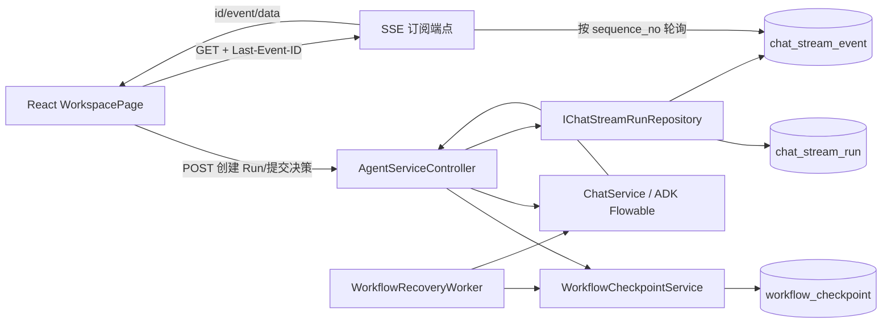
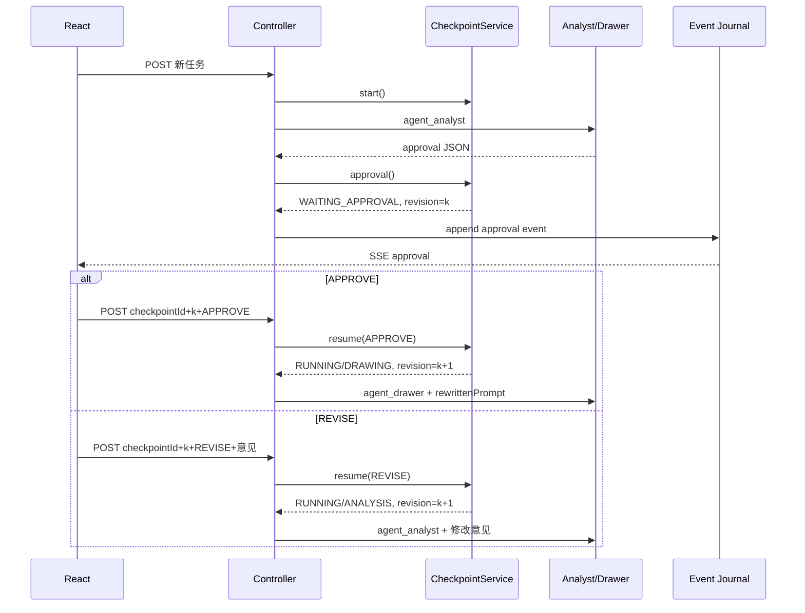

# Checkpoint、Human-in-the-loop 与流式 SSE 功能实现

本文以仓库当前代码为准，解释三个互相配合、但职责不同的能力：

- **Checkpoint** 保存工作流执行到哪里、当前能做什么，以及恢复所需的业务上下文。
- **Human-in-the-loop（HITL）** 在方案确认或高风险工具调用前暂停自动执行，把决策权交给用户。
- **SSE** 把执行进度、模型增量文本、审批请求和最终产物实时推送给浏览器，并通过事件日志支持断线续传。

Checkpoint 解决“状态不能丢”，HITL 解决“关键动作必须由人决定”，SSE 解决“执行过程要实时可见”。SSE 连接断开不等于工作流停止，SSE Run 完成也不一定等于整个业务工作流完成。

---

## 1. 三个核心概念

### 1.1 Checkpoint 是什么

Checkpoint 是工作流的一张**持久化存档**。它不是 Java 线程快照，也不是记录模型生成到第几个 Token，而是在有业务意义的阶段保存：

- 所属用户、Agent 和会话；
- 当前业务阶段与执行状态；
- 原始需求、审核方案和待确认工具调用；
- 错误信息与当前版本号。

本项目实现的是**业务阶段级恢复**：实例在 `DRAWING` 阶段崩溃，恢复任务会重新执行整个绘图阶段，而不是恢复 JVM 调用栈或某个未完成的 Token。

核心实体为：

```java
public class WorkflowCheckpointEntity {
    private String checkpointId;
    private String invocationId;
    private String agentId;
    private String userId;
    private String sessionId;
    private String status;
    private String stage;
    private String originalPrompt;
    private String approvalJson;
    private String pendingToolCallId;
    private String pendingToolConfirmationJson;
    private String errorMessage;
    private long revision;
    private long createdAt;
    private long updatedAt;
}
```

`stage` 与 `status` 不同：

| 字段 | 回答的问题 | 示例 |
|---|---|---|
| `stage` | 业务执行到哪一步 | `ANALYSIS`、`APPROVAL`、`DRAWING`、`TOOL_APPROVAL`、`TOOL_EXECUTION`、`TERMINAL` |
| `status` | 这一步当前能否继续 | `RUNNING`、`WAITING_APPROVAL`、`WAITING_TOOL_APPROVAL`、`PAUSED`、`COMPLETED`、`FAILED`、`CANCELLED` |

两者分开后，`PAUSED + ANALYSIS` 和 `PAUSED + DRAWING` 才能表达“都暂停了，但恢复后应回到不同阶段”。

### 1.2 Human-in-the-loop 是什么

Human-in-the-loop，简称 HITL，指自动流程在关键点主动停下来，请人检查上下文并决定下一步。本项目有两类 HITL：

1. Analyst 生成绘图方案后进入 `WAITING_APPROVAL`，用户批准或要求修改。
2. ADK 请求执行高风险工具时进入 `WAITING_TOOL_APPROVAL`，用户允许或拒绝。

完整 HITL 不只是前端确认框，还必须保证等待状态和审批上下文持久化、刷新后可恢复、过期页面不能覆盖新状态、决策只能作用于正确用户/状态/工具调用。

### 1.3 SSE 是什么

SSE（Server-Sent Events，服务器发送事件）是建立在 HTTP 上的**服务器到浏览器单向事件流**。

普通 HTTP 通常返回一个完整响应后结束。SSE 仍由普通 HTTP 请求建立，但返回：

```http
Content-Type: text/event-stream;charset=UTF-8
Cache-Control: no-cache, no-transform
X-Accel-Buffering: no
```

随后连接保持打开，服务器不断写入 UTF-8 文本帧：

```text
id: 41
event: token
data: {"phase":"drawing","chunk":{"type":"token","content":"正在生成节点"}}

id: 42
event: done
data: {"phase":"done","chunk":{"type":"done"}}

```

空行表示一个事件结束。常用字段：

- `id`：事件游标，断线重连时用于续传；
- `event`：事件类型；
- `data`：事件内容，多行 `data:` 要用换行拼接；
- `:` 开头的行：注释，本项目用作心跳。

SSE 不是与 HTTP 并列的底层协议，它是使用 `text/event-stream` 媒体类型的长时间 HTTP 响应，底层仍是 HTTP/TCP。

---

## 2. SSE、普通 HTTP、轮询与 WebSocket

| 维度 | 普通 HTTP | HTTP 轮询 | HTTP 长轮询 | SSE | WebSocket |
|---|---|---|---|---|---|
| 方向 | 一问一答 | 客户端反复请求 | 请求挂起到有数据 | 服务器持续推送 | 同一连接全双工 |
| 连接 | 一次响应 | 大量重复请求 | 每条消息后重建 | 长 HTTP 响应 | HTTP Upgrade 后的专用连接 |
| 格式 | 任意 Body | 任意 | 任意 | UTF-8 文本事件 | 文本或二进制帧 |
| 断点 | 业务自建 | 业务自建 | 业务自建 | `id` / `Last-Event-ID` | 业务自建 |
| 二进制 | 支持 | 支持 | 支持 | 不直接支持 | 支持 |
| 适用 | CRUD | 低频查询 | 低频通知 | AI Token、日志、进度 | 协同编辑、游戏、语音、双向控制 |

本项目主要由服务器推送 Agent 进度；批准、修改、暂停和取消是低频操作，可以走普通 `POST`。SSE 比维护一套 WebSocket 双向消息协议更简单：

```text
浏览器 --POST /chat_stream----------------> 创建 Run / 提交 HITL 决策
浏览器 <--JSON { runId, checkpointId, ... }- 立即得到任务标识
浏览器 --GET /chat_stream/{runId}----------> 订阅 SSE
浏览器 <== id/event/data 事件流============= 持续接收输出
```

只有出现多人协同编辑、低延迟双向控制或大量客户端消息时，才值得换 WebSocket。

前端使用流式 `fetch` 而不是原生 `EventSource`，因为需要自定义认证头并复用 401 Refresh Token 逻辑。代价是 `chat.stream.ts` 必须自己完成 UTF-8 解码、帧解析、重连和去重。

---

## 3. 整体架构



三个持久化对象不能混淆：

| 对象 | 生命周期 | 作用 |
|---|---|---|
| `workflow_checkpoint` | 整个业务工作流 | 保存阶段、状态、人工决策上下文和恢复版本 |
| `chat_stream_run` | 一次 POST 触发的执行片段 | 保存该次后台执行状态及最后事件序号 |
| `chat_stream_event` | Run 内一条输出 | 保存可回放的 SSE 内容 |

一次方案审核通常包含多个 Run，但复用同一个 Checkpoint：

```text
Run A：分析 -> 产生 approval -> Run A 完成，Checkpoint 等待审批
Run B：用户 APPROVE -> 绘图 -> Run B 完成，Checkpoint 完成
```

所以 `chat_stream_run.status=COMPLETED` 只说明本次流结束；`workflow_checkpoint.status=WAITING_APPROVAL` 仍表示业务在等人。

---

## 4. Checkpoint 状态机

首次请求没有 `checkpointId` 时调用 `WorkflowCheckpointService.start`，创建：

```text
status=RUNNING, stage=ANALYSIS, revision=1
```

### 4.1 状态转移矩阵

| 源状态 | 操作/决策 | 目标状态 | 目标阶段 | 说明 |
|---|---|---|---|---|
| 新任务 | `start` | `RUNNING` | `ANALYSIS` | 开始分析 |
| `RUNNING` | `approval` | `WAITING_APPROVAL` | `APPROVAL` | 等待方案审核 |
| `WAITING_APPROVAL` | `APPROVE` | `RUNNING` | `DRAWING` | 使用 `rewrittenPrompt` 绘图 |
| `WAITING_APPROVAL` | `REVISE` | `RUNNING` | `ANALYSIS` | 携修改意见重新分析 |
| `RUNNING` | `waitForToolApproval` | `WAITING_TOOL_APPROVAL` | `TOOL_APPROVAL` | 保存工具确认上下文 |
| `WAITING_TOOL_APPROVAL` | `TOOL_APPROVE/DENY` | `RUNNING` | `TOOL_EXECUTION` | 交还 ADK 确认流 |
| 非终态 | `pause` | `PAUSED` | 保持 | 人工暂停 |
| `PAUSED` | `CONTINUE` | `RUNNING` | 保持 | 人工继续 |
| `PAUSED/RUNNING` | `resumeRecovery` | `RUNNING` | 保持 | 仅重放分析/绘图 |
| 可执行状态 | `finish(true/false)` | `COMPLETED/FAILED` | `TERMINAL` | 终态 |
| 任意状态 | `cancel` | `CANCELLED` | `TERMINAL` | 取消 |

`finish` 遇到 `WAITING_APPROVAL`、`WAITING_TOOL_APPROVAL`、`PAUSED` 或 `CANCELLED` 会直接返回，防止 ADK 流结束时误把“等待人处理”改成“业务完成”。

### 4.2 Fail-Before-Mutation 与 revision CAS

恢复必须先校验再修改：

```java
public synchronized WorkflowCheckpointEntity resume(
        String id, long expectedRevision, String decision) {
    WorkflowCheckpointEntity cp = get(id);
    if (cp.getRevision() != expectedRevision) {
        throw new AppException("CHECKPOINT_CONFLICT", "Checkpoint 已变化，请刷新后重试");
    }
    // 校验终态、decision、源状态和 approvalJson
    // 全部通过后才 setStatus/setStage
    return touch(cp);
}
```

例如 `APPROVE` 要求源状态为 `WAITING_APPROVAL`，且 `approvalJson.rewrittenPrompt` 非空。否则抛出异常，状态与 revision 都不变。

revision 防止旧页面覆盖新状态。两个页面都拿到 revision 4，先提交者保存为 5，后提交者仍带 4，会收到 `CHECKPOINT_CONFLICT`。

单 JVM 内写方法用 `synchronized`；跨实例由 PostgreSQL CAS 兜底：

```sql
... ON CONFLICT(id) DO UPDATE SET
    status=excluded.status,
    revision=excluded.revision,
    ...
WHERE workflow_checkpoint.revision=excluded.revision-1
```

`touch` 是统一版本入口：

```java
private WorkflowCheckpointEntity touch(WorkflowCheckpointEntity cp) {
    cp.setRevision(cp.getRevision() + 1);
    cp.setUpdatedAt(System.currentTimeMillis());
    return repository.save(cp);
}
```

### 4.3 所有权校验

Controller 在恢复前校验 Checkpoint 与当前用户、会话一致；查询、暂停、取消也调用 `AuthenticatedUserContext.require`。即使知道其他人的 Checkpoint ID，也不能操作其工作流。

---

## 5. HITL 完整调用链

### 5.1 方案审核



`approval` SSE 事件包含方案以及 `checkpointId`、`revision`、`checkpointStatus`。前端只允许操作最新的待审核卡片，点击后创建一个新 Run 继续同一 Checkpoint。

### 5.2 高风险工具审批

ADK 发出 `adk_request_confirmation` Function Call 时，Controller：

1. 脱敏参数；
2. 保存 `pendingToolCallId` 和 `pendingToolConfirmationJson`；
3. 转为 `WAITING_TOOL_APPROVAL/TOOL_APPROVAL`；
4. 写入 `tool_approval` SSE 事件；
5. 前端展示批准/拒绝按钮。

用户决定必须满足：

```text
TOOL_APPROVE <=> toolConfirmed=true
TOOL_DENY    <=> toolConfirmed=false
toolConfirmationCallId == checkpoint.pendingToolCallId
checkpointRevision == 当前 revision
```

通过后调用 `handleToolConfirmationStream(...)` 将决定交给 ADK。待审批 `callId` 和确认 JSON 不清空，用于审计；是否仍待审批由 `status` 判断。

### 5.3 暂停、继续和取消

```text
GET  /api/v1/workflows/{checkpointId}
POST /api/v1/workflows/{checkpointId}/pause
POST /api/v1/workflows/{checkpointId}/cancel
```

继续通过新的 `POST /chat_stream` 提交 `checkpointDecision=CONTINUE` 和当前 revision。

当前暂停是**业务状态暂停**，不是对正在运行的 ADK/RxJava 执行做分布式抢占中断。若要求按钮按下后立即停止模型和外部工具，还需传播取消信号，并处理工具副作用幂等。

---

## 6. 持久化 SSE Run 与事件日志

### 6.1 为什么创建与订阅分离

若一个 `POST` 直接返回 `SseEmitter`，启动任务和观看任务会绑在一条连接上。刷新后难以判断应重新执行还是仅恢复观看。

当前拆为：

1. `POST /api/v1/chat_stream`：校验、处理 Checkpoint、创建 Run、后台启动一次工作流；
2. `GET /api/v1/chat_stream/{runId}`：只从日志读取并推送事件。

因此 SSE 断线不会重新触发 Agent。`idempotencyKey` 保证创建请求重试返回原 Run。

### 6.2 表结构与原子序号

V23 新增 `chat_stream_run` 和 `chat_stream_event`。前者保存 `run_id/status/last_sequence_no/checkpoint_id`，后者保存 `run_id/sequence_no/event_type/phase/data_json`，并约束 `(run_id, sequence_no)` 唯一。

追加事件在事务中先原子递增 Run 游标，再插入事件：

```java
long seq = jdbc.query(
    "UPDATE chat_stream_run SET last_sequence_no=last_sequence_no+1 " +
    "WHERE run_id=? RETURNING last_sequence_no", ...
).get(0);
jdbc.update(
    "INSERT INTO chat_stream_event " +
    "(run_id,sequence_no,event_type,phase,data_json) VALUES (?,?,?,?,?)",
    runId, seq, eventType, phase, dataJson);
```

PostgreSQL 行锁保证并发追加的序号单调唯一；事务保证游标和事件一起提交或一起回滚。

### 6.3 事件模型

Controller 先写 `checkpoint`，再将 ADK Flowable 放入后台执行器。事件统一封装为：

```json
{"phase":"drawing","chunk":{"type":"token","content":"..."}}
```

支持的 `chunk.type`：

| 类型 | 用途 |
|---|---|
| `checkpoint` | 当前 Checkpoint、revision、状态 |
| `token` / `status` | 增量文本和状态 |
| `tool` | 工具开始、成功或失败 |
| `approval` / `tool_approval` | 两类 HITL 卡片 |
| `drawio_node` / `drawio_edge` | 增量构图 |
| `drawio_done` / `drawio` | 最终 XML |
| `ppt_raw` | PPT 原始结果 |
| `error` / `done` | 失败或正常结束 |

正常完成先写 `done` 再把 Run 改为 `COMPLETED`；错误先写 `error` 再改为 `FAILED`，确保订阅者能读完终止事件。

### 6.4 服务端订阅

```text
GET /api/v1/chat_stream/{runId}?after=42
Last-Event-ID: 42
Accept: text/event-stream
```

服务端流程：

1. 校验 Run 存在且属于当前用户；
2. 合法 `Last-Event-ID` 优先，否则用 `after`，最后回退 0；
3. 每 250ms 查询最多 100 条 `sequence_no > cursor` 事件；
4. 写出 `id`、`event`、`data`；
5. 空闲 15 秒发送 `:heartbeat`；
6. Run 终止且游标追到 `last_sequence_no` 后关闭。

```java
emitter.send(SseEmitter.event()
    .id(String.valueOf(event.getSequenceNo()))
    .name(event.getEventType())
    .data(dataObj, MediaType.APPLICATION_JSON));
```

心跳用于发现失效连接并减少网关空闲超时；`X-Accel-Buffering: no` 防止 Nginx 缓冲事件。

### 6.5 前端解析：网络块不等于事件帧

一次 `reader.read()` 可能只含半个中文字符，也可能含多个事件，不能逐块 `JSON.parse`。`parseSseStream` 的顺序是：

```text
Uint8Array
 -> TextDecoder(stream=true)
 -> 按 CR/LF/CRLF 拆行
 -> 收集 event、id、多行 data
 -> 空行才分派事件
 -> JSON.parse(dataLines.join("\n"))
 -> 运行时结构校验
```

它支持注释、多行 data 和任意 UTF-8 边界；坏帧交给 `onMalformed`，不会中断整条流。

### 6.6 断线续传与投递语义

前端维护 `lastSeenSeq`，收到 `id <= lastSeenSeq` 的事件直接丢弃。连接在 `done/error` 前 EOF，或遇到网络错误、5xx、408、429 时最多重试 6 次：

```text
500ms -> 1s -> 2s -> 4s -> 8s -> 10s（上限）
```

重连同时携带 `Last-Event-ID` 与 `?after=`，服务端查询 `sequence_no > cursor`。

若连接在“服务端发送成功、客户端记录 ID 前”断开，事件可能重发，前端按 ID 去重。因此这里是持久日志上的**至少一次传输 + 幂等消费**，不是端到端 exactly-once。

恢复历史会话时前端查询 `active_run`。若 Run 仍为 `RUNNING`，只重新订阅，不再 POST。当前页面恢复路径从 0 回放该 Run 的完整日志；连接内重试则从最后游标精确续传。

---

## 7. 实例故障后的业务恢复

SSE 重连只能恢复“观看输出”，不能恢复已经崩溃的 Agent。`WorkflowRecoveryWorker` 从恢复队列领取任务后调用：

```java
checkpoints.resumeRecovery(checkpointId, checkpointRevision);
```

- `ANALYSIS`：重放 Analyst，重新产生审核方案并回到 `WAITING_APPROVAL`；
- `DRAWING`：用已批准方案重放 Drawer，保存 Draw.io 消息和 Artifact，再完成 Checkpoint；
- 其他阶段不允许后台越过人工审批；
- Queue 使用 `FOR UPDATE SKIP LOCKED` 供多实例领取；
- revision CAS 防止两个 Worker 同时恢复；
- 默认失败最多重试 3 次。

后台 `resumeRecovery` 与用户 `CONTINUE` 分开：前者允许 `PAUSED/RUNNING` 的可重放阶段，后者只允许 `PAUSED`。

外部工具如有不可重复副作用，必须用 invocation/request/call ID 实现业务幂等，不能只依赖 Checkpoint。

---

## 8. 端到端请求示例

### 8.1 新任务

```http
POST /api/v1/chat_stream
Content-Type: application/json

{
  "agentId":"300000",
  "userId":"admin",
  "sessionId":"session-1",
  "conversationId":"...",
  "message":"绘制订单系统架构图",
  "idempotencyKey":"browser-request-uuid"
}
```

响应包含 `runId`、`checkpointId`、`checkpointRevision` 和 Run 状态；随后 GET 对应 `runId` 订阅。

### 8.2 批准方案

```json
{
  "agentId":"300000",
  "userId":"admin",
  "sessionId":"session-1",
  "checkpointId":"checkpoint-uuid",
  "checkpointRevision":2,
  "checkpointDecision":"APPROVE",
  "idempotencyKey":"approval-request-uuid"
}
```

服务器验证 revision 和状态，改为 `RUNNING/DRAWING`，创建新 Run，并用 `rewrittenPrompt` 调用 Drawer。

### 8.3 批准高风险工具

```json
{
  "checkpointId":"checkpoint-uuid",
  "checkpointRevision":5,
  "checkpointDecision":"TOOL_APPROVE",
  "toolConfirmationCallId":"adk-call-id",
  "toolConfirmed":true,
  "toolConfirmationPayload":{},
  "idempotencyKey":"tool-approval-request-uuid"
}
```

callId、布尔决定、状态和 revision 必须全部匹配。

---

## 9. 测试与验证

后端测试覆盖合法/非法状态迁移、旧 revision、损坏 approval、工具审批字段、恢复阶段限制、并发事件序号、游标回放、心跳和终态关闭。前端测试覆盖 UTF-8 分块、CR/LF/CRLF、多行 data、坏帧、EOF 重连、重复 ID、指数退避、Abort 和 Run 重新附着。

```powershell
mvn -pl ai-agent-scaffold-draw-io-app -am `
  "-Dtest=WorkflowCheckpointServiceTest,ChatStreamRunTest,SseChatStreamTest" `
  "-Dsurefire.failIfNoSpecifiedTests=false" test

npm --prefix front test -- --run src/features/chat/chat.stream.test.ts
```

---

## 10. 正确性不变量与当前限制

必须保持的不变量：

1. revision 只能递增，旧 revision 不能覆盖新状态。
2. 决策必须匹配源状态，校验失败不能改变实体或 revision。
3. Checkpoint、Run 和 SSE 订阅都必须校验当前用户。
4. 工具决定必须匹配待确认 callId。
5. Run 内事件序号唯一单调，回放条件始终为 `sequence_no > cursor`。
6. 终止事件先落库，Run 后进入终态，订阅端追平后才关闭。
7. 网络断开不能重新启动 Agent；只有显式创建 Run 才会执行。
8. HITL 等待状态不能被普通完成回调覆盖。

当前限制：

- Checkpoint 是阶段级而非 Token/线程栈级续跑；
- 暂停不会强制中断所有正在运行的模型和外部工具；
- 有副作用工具的 exactly-once 需要工具自身幂等；
- SSE 日志尚未定义保留期和清理任务；
- SSE 每 250ms 轮询数据库，规模明显增大后再评估 `LISTEN/NOTIFY` 或消息系统；
- 页面恢复从 0 回放活动 Run，若单 Run 事件量很大，应复用 `sessionStorage.lastSequenceNo` 并建立明确 UI 去重键；
- `synchronized` 只覆盖单 JVM，跨实例依赖 PostgreSQL revision CAS；
- 审批超时、审批 RBAC 和分布式取消广播尚未实现。

没有出现对应规模或需求前，不需要引入状态机框架、WebSocket、Kafka 或新的工作流引擎。

---

## 11. 代码索引

| 功能 | 文件 |
|---|---|
| Checkpoint 实体/状态机 | `WorkflowCheckpointEntity.java`、`WorkflowCheckpointService.java` |
| Checkpoint PostgreSQL CAS | `PostgresWorkflowCheckpointRepository.java` |
| Run/Event 仓储 | `IChatStreamRunRepository.java`、`PostgresChatStreamRunRepository.java` |
| Run 创建、HITL、SSE 订阅 | `AgentServiceController.java` |
| 实例恢复 | `WorkflowRecoveryWorker.java` |
| SSE 解析与重连 | `front/src/features/chat/chat.stream.ts` |
| HITL UI | `WorkspacePage.tsx`、`MessageList.tsx` |
| 数据库迁移 | `V1__agent_platform_schema.sql`、`V2__session_checkpoint_payload.sql`、`V10__runtime_recovery_scheduler.sql`、`V23__chat_stream_durable_run_and_event_journal.sql` |

一句话总结：**Checkpoint 保存业务状态，HITL 用状态机和 revision CAS 接收人的决定，后台执行把输出写入持久事件日志，SSE 再按游标将日志可靠地推送给浏览器。**
