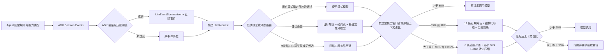

# 上下文工程与压缩：四层上下文模型

## 1. 结论

项目已经形成可运行的四层上下文模型：固定规则由 Agent/Runner 装配；结构化流程与 Draw.io 图状态由请求级插件确定性提取；近期对话按滑动窗口保留；大 Tool/MCP Result 在不破坏调用协议的前提下缩减。会话级继续复用 Google ADK 的事件摘要压缩，请求级由 `ContextCompressionPlugin` 做第二道保护。模型动态路由已接入生产请求链路：先根据当前原始请求确定 Fast、Balanced 或 Reasoning 目标层级并选出唯一模型，再按该模型的上下文窗口执行请求级容量保护。

本次不引入 LangGraph、MemGPT/Letta、新向量库或厂商专用压缩 API。现有 ADK 1.7 和项目已有快照仓储已经覆盖当前需求，新增框架只会形成重复状态源。

### 1.1 实现位置

| 职责 | 文件 / 入口 |
| --- | --- |
| ADK 会话级事件摘要 | `ai-agent-scaffold-draw-io-domain/.../armory/node/RunnerNode.java`：装配 `EventsCompactionConfig` 与 `LlmEventSummarizer` |
| 请求级四层压缩 | `ai-agent-scaffold-draw-io-domain/.../armory/matter/plugin/ContextCompressionPlugin.java`：`beforeModelCallback` |
| 请求级动态模型路由 | `ai-agent-scaffold-draw-io-domain/.../armory/matter/plugin/CustomConfigPlugin.java`：显式模型校验或动态选择 |
| 路由需求、硬约束与排序 | `ai-agent-scaffold-draw-io-domain/.../llm/routing`：任务识别、约束过滤和 cheapest-sufficient 排序 |
| 模型层级与能力目录 | `ai-agent-scaffold-draw-io-app/src/main/resources/model-catalog.yml`：Fast/Balanced/Reasoning、能力、限制和价格 |
| 压缩阈值与事件保留数 | `ai-agent-scaffold-draw-io-app/src/main/resources/agent/agent-{general,draw-io,ppt}.yml` |
| 快照领域端口 | `ai-agent-scaffold-draw-io-domain/.../adapter/repository/IContextSnapshotRepository.java` |
| JDBC 快照持久化 | `ai-agent-scaffold-draw-io-infrastructure/.../persistence/JdbcContextSnapshotRepository.java` |
| 聚焦回归测试 | `ai-agent-scaffold-draw-io-app/src/test/java/cn/bugstack/ai/test/domain/agent/ContextCompressionPluginTest.java` |

## 2. 当前实现

### 2.1 四层职责

| 层 | 内容 | 当前实现 | 压缩原则 |
| --- | --- | --- | --- |
| 固定规则 | Agent 指令、Tool Schema、Skill 目录 | YAML/Runner/能力装配 | 不写入历史摘要，不随滑动窗口删除 |
| 结构化流程状态 | 任务目标、工作流阶段、审批结果、Artifact 引用、Draw.io 节点/边/布局 | `ContextCompressionPlugin.structuredProjectState` | 只保留白名单字段；图状态确定性解析 |
| 近期对话 | 最近用户、模型和工具交互 | `beforeModelCallback` 滑动窗口 | 普通压缩保留 12 条，激进压缩保留 6 条；不拆散 Tool Call/Response |
| Tool Result | FunctionResponse/MCP 结果 | `trimToolResult` | 小结果原样保留；大结果保留工具名、callId、摘要、指纹和 Artifact ID |

固定规则与动态历史分开，避免模型把压缩摘要误当成新规则。结构化状态位于压缩信封前部，近期对话位于请求尾部，也降低关键约束长期埋在大段历史中间的风险。

### 2.2 端到端流程



项目 YAML 将 ADK compaction token threshold 配置为 `89600`，并保留最近 `12` 个事件。请求级插件再根据活动模型目录中的 `contextWindowTokens` 计算占比；模型未注册时回退到 `128000`。原始请求即使达到或超过 `95%`，也优先进入激进压缩链路；在重建请求后按相同规则估算，仅在压缩后依然 `>= 95%` 时才拒绝请求。

### 2.3 结构化 Draw.io 状态

插件从 `final_result` 或 `draft_diagram` 提取 NDJSON 或完整 Draw.io XML，保存：

- 节点：`id`、`label`、`parent`、`style`、`x/y/width/height/relative`；
- 连线：`id`、`label`、`source`、`target`、`parent`、`style`、端点与折点；
- 全局约束：保持当前布局与主题；
- 内容指纹：用于识别状态来源是否变化。

XML 使用关闭 DTD、外部实体、外部参数实体、外部 DTD 和 XInclude 的解析器。安全特性无法配置时直接失败，不回退到不安全解析；单个残缺 NDJSON/XML 片段只跳过该片段，不影响同批其他合法节点和连线。

### 2.4 Tool 调用完整性

滑动窗口切点维护 Tool Call / Tool Response 边界安全且不向前历史回溯：当保留窗口中的 FunctionResponse/ToolResponse 缺少匹配的 FunctionCall/ToolCall 时，切点向后推进至该孤立响应之后将其剔除；若剔除后导致后续响应因前序调用丢失而成为连锁孤立响应，则重新求值并继续后移切点，保证保留的近期窗口为紧凑连续后缀且绝不向前借用历史。配对时优先按 call ID 严格匹配（有 ID 的响应仅匹配同 ID 调用），仅在响应无 ID 时按函数名兜底，避免向模型 API 发送孤立工具响应。

超长 FunctionResponse 不会被替换成普通文本，而是仍以 FunctionResponse 发送，并保留：

- 原工具名和调用 ID；
- `truncated=true`；
- 有界摘要；
- UUID 内容指纹；
- 已存在的 `artifact_id` / `artifactId` / `result_artifact_id`。

完整 Tool Result 应由 Artifact/业务仓储长期保存；模型上下文只承担近期工作集，不承担事实源职责。

### 2.5 动态路由与四层上下文的协作

Agent YAML 中 `customConfigPlugin` 位于 `contextCompressionPlugin` 之前，因此一次请求按以下顺序处理：

1. 路由器只读取当前请求上下文，提取最新用户意图、活动 Agent 和 Token 规模，不额外调用模型；
2. 用户显式选择优先，但目录内模型必须启用、具备可执行 Provider，并通过当前请求的硬约束；校验不可用时直接失败，不静默换模型；
3. 自动路由先过滤上下文窗口、输出上限、Vision、Tool Calling 和结构化输出等硬约束；
4. `SIMPLE_EDIT`、`FORMAT`、`SUMMARIZE`、`EXTRACT` 从 Fast 开始，普通或不确定任务从 Balanced 开始，诊断、深度分析和 Draw.io 审查从 Reasoning 开始；
5. 每个层级只在能力满足度达到 `0.85` 的候选中选择已知价格优先、成本最低的模型；当前层无充分模型才向更高层升级；
6. 如果所有允许层级都不充分，则能力匹配度优先；如果自动分析失败或无候选，则有界回退旧路由器；
7. 路由器只把一个模型写入 `LlmRequest.Builder`。Top-3 仅用于评估快照，不会并行调用、投票或合并结果；
8. 压缩插件随后读取已经选定的模型，从模型目录取得其 `contextWindowTokens`，再决定直接放行、普通压缩、激进压缩或拒绝。

这使模型选择与上下文容量形成单向、可解释的链路：任务需求决定模型，模型窗口决定压缩水位；压缩不会反过来把历史长度误判为任务复杂度，也不会通过多模型调用放大成本。

### 2.6 状态持久化与观测

发生请求级压缩后，插件：

1. 将 `diagram_project_state` 写回当前 invocation state；
2. 通过 `LightweightMonitorService` 记录压缩前后估算 Token、策略和耗时；
3. 若 `IContextSnapshotRepository` 可用，保存压缩信封、结构化状态、模型名和统计数据；
4. 若快照仓储未装配，压缩仍可继续，持久化增强被跳过；
5. 若压缩后依然超限被拒绝，则抛出异常中断，不记录成功压缩监控和持久化快照。

路由侧同时记录实际模型、推荐模型、选择来源、目标层级、选择原因、候选快照和估算成本。`DYNAMIC_ROUTER` 表示动态路由实际接管，`USER_EXPLICIT` 表示用户覆盖，`LEGACY_ROUTER` 只表示配置关闭或自动路由内部失败后的有界回退。当前 ADK 回调没有可靠的流程阶段字段，路由上下文中的 `workflowStage` 保持 `UNKNOWN`，不根据对话文本伪造阶段。

## 3. 水位与失败语义

| 阶段 / 上下文占比 | 行为 |
| --- | --- |
| 原始请求 `< 85%` | 不修改请求，快速放行 |
| 原始请求 `85%–<90%` | 普通压缩：保留最近 12 条，注入结构化状态和抽取式历史摘要，Tool Result 软截断 4000 字符 |
| 原始请求 `>= 90%`（含 `>= 95%`） | 激进压缩：保留最近 6 条，缩短历史摘要，Tool Result 软截断 1600 字符 |
| 压缩后重新估算 `>= 95%` | 抛出 `IllegalStateException` 拒绝请求并提示新建会话，不记录成功压缩监控与快照 |
| 压缩后重新估算 `< 95%` | 放行压缩请求进入模型调用，记录监控与快照 |

Token 数使用项目已有 `ContextTokenEstimator`，当前实现是面向中英文混合文本的字符启发式估算，不是供应商计费 Token 的精确 BPE。它适合容量保护，但监控数值不应当作账单依据。

## 4. 成熟与前沿方案比较

| 方案 | 成熟做法 | 对本项目适配性 | 决策 |
| --- | --- | --- | --- |
| [Google ADK Context Compression](https://adk.dev/context/compaction/) | App 级事件压缩、近期事件重叠/保留、可替换 summarizer | 当前运行时已经是 ADK 1.7，可直接复用 Session Event 语义 | **采用**：继续作为会话级第一层压缩 |
| [LangGraph Memory](https://langchain-ai.github.io/langgraph/how-tos/memory/manage-conversation-history/) | 消息裁剪、摘要节点、线程状态和 checkpoint | 思路与当前实现相近，但引入 Python/另一套图状态机将重复 ADK 和业务 checkpoint | **不引入**：只借鉴“状态与消息分离”模式 |
| [OpenAI Responses Compact API](https://developers.openai.com/api/reference/java/resources/responses/methods/compact) | `/responses/compact` 返回供后续请求继续使用的 opaque compaction item，并报告压缩用量 | 当前主链是 ADK 的 OpenAI-compatible Chat Completions，不是 OpenAI Responses；opaque 状态也不能替代可审计 Draw.io 结构化状态 | **暂不接入**：迁移到原生 Responses 且供应商锁定可接受时再评估 |
| [Anthropic Context Editing](https://platform.claude.com/docs/en/build-with-claude/context-editing) | 按阈值清理旧 Tool Result，可与 memory/整段 compaction 结合 | “先保存重要结果、再清旧工具输出”与本项目 Artifact + Tool Result 摘要一致；API 为 Claude 专用 | **借鉴模式，不接 SDK** |
| [MemGPT](https://arxiv.org/abs/2310.08560) | 类操作系统的分层虚拟上下文，在快/慢记忆间分页 | 适合跨会话、超长任务的主动记忆管理；当前项目已有 Session、Memory、Snapshot 和 Artifact，增加新内存层收益未证实 | **延后**：出现可量化跨会话召回缺口再做 |
| [Lost in the Middle](https://arxiv.org/abs/2307.03172) | 研究显示相关信息位于长上下文中部时，模型利用能力可能明显下降 | 支持把固定规则放开头、结构化不变量放压缩信封、当前对话放末尾，而不是单纯扩大窗口 | **采用其设计约束** |
| [CMV](https://arxiv.org/abs/2602.22402) | 以 DAG 快照、分支和结构无损裁剪管理 Agent 上下文 | 对多分支 Agent 有启发，但目前是较新的预印本，公开证据主要是小规模/单用户案例；项目现有 checkpoint 已承担业务分支恢复 | **不落地**：等待成熟实现和本项目分支复用需求 |

### 推荐组合

当前最合适的是“ADK 原生摘要 + 项目确定性状态 + 近期滑动窗口 + Artifact 化 Tool Result”的组合。它使用已有依赖和仓储，同时把自然语言摘要的有损风险限制在非关键历史；节点、连线和布局不变量不依赖摘要模型记忆。

## 5. 测试与验证

`ContextCompressionPluginTest` 当前包含 8 个聚焦用例，覆盖：

- 注册模型上下文窗口和 128K 回退；
- 状态字段白名单与未知敏感字段排除；
- NDJSON、完整 XML、残缺相邻片段；
- 节点/连线 ID、标签、样式、几何和端点；
- 大 FunctionResponse 的结构化缩减与 Artifact 引用；
- Tool 边界修复不回溯历史、剔除孤立响应与连锁孤立响应、保留完整配对；
- 原始请求 `>=95%` 进入激进压缩并在压缩后 `<95%` 时正常放行与监控；
- 压缩后请求仍 `>=95%` 时抛出异常拒绝且不产生成功监控/快照。

已由 AGY 执行：

```text
mvn -pl ai-agent-scaffold-draw-io-app -am -Dtest=ContextCompressionPluginTest -Dsurefire.failIfNoSpecifiedTests=false test
Tests run: 8, Failures: 0, Errors: 0, Skipped: 0
```

动态路由与上下文窗口协作已通过 `CustomConfigPluginTest`、`DefaultModelRankerTest`、`DynamicModelRankingServiceTest`、`RoutingRequirementAnalyzerTest`、`ModelConstraintFilterTest` 和目录/评分配置测试验证。最终 Maven 结果为：聚焦路由测试 91 项全部通过；全量多模块测试 277 项，0 失败、0 错误、2 项跳过。

## 6. 已知限制与后续门槛

- Token 是启发式估算；只有出现错误压缩水位或供应商 Token 统计明显偏差时，才引入模型专用 tokenizer。
- 抽取式历史摘要只保存短文本和工具身份，不能替代完整审计记录；需要追溯时读取 Session Event、Snapshot 或 Artifact。
- 缺少 call ID 时按工具名配对，重复同名并发调用可能产生歧义；只有实际出现该协议输入时再增加序列级配对。
- 当前验证是单元测试和本地多模块构建，不包含真实远程模型长会话；上线前应以包含节点、连线、折点、样式和大工具输出的回放集验证压缩前后不变量。
- `0.85` 是当前目录能力数据的首轮工程校准，不是供应商官方基准；上线后应依据质量、成本、延迟和回退率评测数据调整，而不是在线自动学习或按强模型数量分配配额。
- ADK 模型回调暂不提供可靠流程阶段，动态路由保留 `UNKNOWN`；只有出现可信的结构化阶段来源时才接入，不从自然语言猜测。
- 不做向量记忆、DAG 上下文虚拟化和厂商专用 compaction。仅当现有 Session/Snapshot/Artifact 无法满足经评测确认的跨会话召回或并行分支复用需求时再增加。
