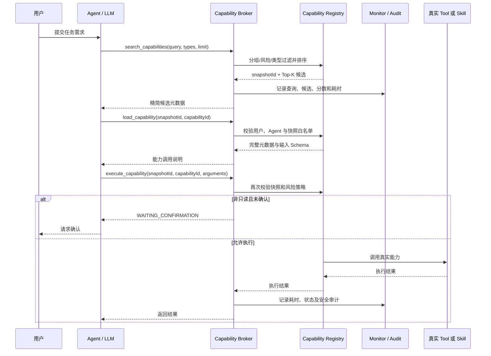

# 动态 Tools / Skills 按需检索、加载与执行技术实现

## 1. 功能概述

本功能通过 `Capability Registry + Capability Broker` 将数量可能持续增长的 Tool 与 Skill 从模型初始上下文中移出。Agent 常驻上下文只暴露三个稳定的元工具：

- `search_capabilities`：根据自然语言需求检索候选能力，并生成调用范围内的 Top-K 快照；
- `load_capability`：从快照中加载某个能力的完整元数据及输入 Schema；
- `execute_capability`：执行已经进入快照且通过权限校验的能力。

当前检索采用带元数据的确定性词法排序，不使用向量数据库或 RAG。Tool 与 Skill 可以通过 `aliases`、`examples`、`negativeExamples` 描述适用场景，使中文表达、同义词和容易误选的场景能够参与排序。

### 1.1 实现范围

| 职责 | 实现文件 |
| --- | --- |
| 能力描述模型 | `CapabilityDescriptor.java` |
| 注册、过滤、排序、快照及执行校验 | `CapabilityRegistryService.java` |
| 三个模型可见的 Broker 工具 | `CapabilityBrokerToolset.java` |
| Skill 注册入口 | `DefaultToolSkillsCreateService.java` |
| MCP Toolset 注册入口 | `ChatModelNode.java` |
| 检索与执行监控 | `LightweightMonitorService.java`、`JdbcRuntimeObservationRepository.java` |
| 功能与干扰能力测试 | `CapabilityRegistryServiceTest.java` |

## 2. 实施难点与挑战

### 2.1 模型上下文与能力规模之间的冲突

如果将所有 Tool Schema 和完整 Skill 内容直接放入模型上下文，能力数量增长会导致：

- 输入 Token 持续增加；
- 名称和描述相近的能力互相干扰；
- 模型选错工具的概率提高；
- 每次请求都重复传输本次任务根本不会使用的能力定义。

因此，系统不能再把“能力存在”直接等同于“能力必须预加载”。注册表负责保存全量能力，模型只接触经过检索缩小后的候选集合。

### 2.2 小规模能力下缺少真实排序压力

原始 Tool / Skill 数量较少，即使使用简单关键词包含判断，也很容易得到看似正确的结果，无法证明以下场景是否可靠：

- `svg_export` 与 `svg_exporter` 等相似名称竞争；
- “绘制架构图”“帮我画一个系统架构图”等中文表达没有直接命中英文名称；
- Draw.io Skill 不应因为包含“图”而被用于生成 PPT 或思维导图；
- 排序分数相同时，结果是否可复现；
- 类型、Agent 分组和风险策略是否在排序前生效。

为此，测试代码中构建了 10 个虚假 Skills 和 25 个虚假 Tools，形成同名、近义、跨类型、跨分组和不同风险等级的干扰目录。虚假能力没有进入生产注册流程。

### 2.3 检索结果不能直接成为执行权限

如果模型能够传入任意 `capabilityId` 执行能力，那么检索、分组和风险过滤都可以被绕过。系统必须确保：

1. 能力经过当前 Agent 的类型、分组和风险策略过滤；
2. 能力进入本次检索生成的快照；
3. 加载和执行时，快照仍属于同一用户与 Agent；
4. 非只读能力仍需走用户确认与安全审计。

因此，Top-K 结果不仅是排序结果，也是后续加载和执行的能力白名单。

### 2.4 元数据质量与输入边界

Tool 自定义元数据和 Skill Frontmatter 都属于配置输入，可能出现超长字符串、重复值、空值、数字、布尔值或嵌套对象。如果直接调用 `toString()`，错误配置会变成可检索文本，污染召回结果。

当前实现只接受单个字符串、字符串集合或字符串数组，并执行：

- 去除首尾空白和空字符串；
- 保留原始顺序并去重；
- 每类最多保留 16 条；
- 单条最多保留 200 个字符；
- 忽略所有非字符串元素。

## 3. 方案选型与决策理由

### 3.1 方案对比

| 方案 | 优点 | 代价与风险 | 当前决策 |
| --- | --- | --- | --- |
| 全量 Tool / Skill 预加载 | 实现简单，没有检索阶段 | 上下文随能力数量线性增长，干扰严重 | 不采用 |
| 纯名称关键词匹配 | 无依赖、速度快 | 中文同义表达和意图边界较弱 | 已升级 |
| 元数据增强的词法排序 | 无新基础设施；结果可解释、可复现；适合当前规模 | 不能理解完全无词面重合的语义 | 当前采用 |
| 向量检索 | 可召回语义相近但词面不同的能力 | 增加嵌入模型、向量索引、版本管理和评测复杂度 | 暂不采用 |
| 词法 + 向量 + 重排 | 大规模目录下召回和精排能力更强 | 成本、延迟、可观测性及调参工作量最高 | 达到明确门槛后再评估 |

### 3.2 当前决策依据

当前真实能力目录仍小，尚无评测数据证明向量检索能带来足以抵消复杂度的收益。元数据增强词法检索已经覆盖当前暴露出的主要问题：

- `aliases` 解决同义词和中英文名称差异；
- `examples` 解决用户自然语言与能力描述不一致；
- `negativeExamples` 约束容易误选的明确场景；
- 确定性权重和能力 ID 次级排序保证问题可复现；
- 测试干扰目录使排序质量能够在不污染生产环境的前提下回归验证。

核心设计原则是：

1. **最小上下文暴露**：模型只常驻三个 Broker 工具；
2. **先治理、后排序**：类型、分组和风险过滤先于相关性计算；
3. **检索即授权边界**：只有快照中的能力能够被加载和执行；
4. **结果可解释和可复现**：不依赖随机或外部模型完成当前排序；
5. **以评测驱动复杂度**：只有词法基线出现可量化瓶颈时才引入向量检索。

## 4. 核心实现逻辑

### 4.1 能力注册与统一描述

Tool 与 Skill 在注册时被转换为同一个 `CapabilityDescriptor`：

```java
public record CapabilityDescriptor(
        String capabilityId,
        String type,
        String group,
        String name,
        String description,
        List<String> tags,
        List<String> aliases,
        List<String> examples,
        List<String> negativeExamples,
        String riskLevel,
        Map<String, Object> inputSchema,
        int version,
        String schemaVersion,
        String contentVersion) {
}
```

注册阶段完成四项工作：

1. 生成稳定 ID，例如 `java_tool:export:svg_export` 或 `skill:diagram:drawio-architect`；
2. 从 Tool `customMetadata` 或 Skill Frontmatter `metadata` 读取检索元数据；
3. 计算 Schema 与内容指纹，用于识别能力定义变化；
4. 保存描述对象及实际执行函数，搜索阶段不执行真实能力。

MCP Toolset 由 `ChatModelNode` 注册，Skills 由 `DefaultToolSkillsCreateService` 注册，因此 Broker 不需要知道能力的具体来源。

### 4.2 过滤和加权排序

搜索执行顺序如下：

```java
entries.values().stream()
    // 治理条件先于相关性计算，避免无权限能力进入候选集
    .filter(entry -> groupAllowed(entry, agentName))
    .filter(entry -> riskAllowed(entry, agentName))
    .filter(entry -> typeAllowed(entry, requestedTypes))
    .map(entry -> score(query, entry.descriptor()))
    .filter(item -> item.score() > 0)
    .sorted(byScoreDescending.thenComparing(capabilityId))
    .limit(Math.min(requestedLimit, 16));
```

当前主要权重如下：

| 命中条件 | 基础分值 |
| --- | ---: |
| 完整 Capability ID | +100 |
| 完整名称 | +80 |
| 名称包含关系 | +25 |
| Alias 完全匹配 | +50 |
| Alias 包含关系 | +20 |
| Example 完全匹配 | +35 |
| Example 包含关系 | +18 |
| 描述、分组或标签包含完整查询 | +8 |
| Negative Example 完全匹配 | -60 |
| Negative Example 包含关系 | -30 |

查询还会生成词元；长度至少为 4 的连续词会补充二元片段，以支持较长中文短语和组合词的部分匹配。词元根据出现位置继续加权：Alias 权重最高，其次是 Example、名称及描述字段。

负例只对完整短语或包含关系扣分，不对每个短词和二元片段反复扣分。这样可以避免中文公共片段造成无关能力被过度惩罚。

分数相同时按照 `capabilityId` 排序，保证相同注册表与查询总能产生相同候选顺序。

### 4.3 Top-K 快照与安全边界

每次搜索都会生成 UUID 快照，保存以下信息：

- `invocationId`；
- `userId`；
- `agentName`；
- Top-K 候选能力 ID 集合；
- 创建时间。

加载或执行能力时，Registry 会验证：

```text
快照存在
  AND 当前用户与快照用户一致
  AND 当前 Agent 与快照 Agent 一致
  AND capabilityId 位于快照候选集合
  AND 当前 Agent 风险权限仍然允许该能力
```

内存中最多保留 500 个快照，超过后按照创建顺序淘汰最旧快照。Broker 同时把当前快照 ID 和候选 ID 写入 ADK Session State；进程内快照缺失但会话状态仍有效时，可以恢复候选白名单。

### 4.4 Broker 的渐进式信息披露

三个工具返回的信息量逐步增加：

| 阶段 | 返回内容 |
| --- | --- |
| Search | ID、类型、名称、描述、分组、Alias、风险、版本、分数 |
| Load | Search 内容 + Examples、Negative Examples、完整输入 Schema |
| Execute | 真实能力执行结果 |

Search 不返回所有候选的完整 Schema，从而控制模型上下文；只有模型选定某个候选后，Load 才公开其调用参数。

### 4.5 风险确认与审计

`execute_capability` 在执行非 `READ_ONLY` 能力前检查 Tool Confirmation：

- 尚未确认：返回 `WAITING_CONFIRMATION` 并请求用户确认；
- 用户拒绝：返回 `DENIED`；
- 用户批准：执行能力，并记录批准及执行结果；
- 执行异常：记录失败状态和错误摘要。

因此，能力被检索到并不意味着它能够绕过交互确认直接执行。

### 4.6 核心时序



## 5. 最终效果与收益

### 5.1 定性收益

- **上下文治理**：Agent 的稳定工具面保持为 3 个 Broker 工具，不再随实际能力数量同步膨胀；
- **选择准确性**：Alias、Example 和 Negative Example 能表达名称以外的适用及排除场景；
- **安全性**：类型、分组、风险、快照归属和用户确认形成多层执行约束；
- **可维护性**：Tool 和 Skill 使用统一能力模型，新能力通过注册进入系统，无需修改 Broker 协议；
- **可诊断性**：检索候选、排名分数、加载和执行状态进入统一监控数据；
- **可测试性**：测试专用干扰目录能够稳定复现近义能力竞争，而不污染生产配置。

### 5.2 已验证的定量边界

| 指标 | 当前结果 |
| --- | ---: |
| 模型常驻 Broker 工具数量 | 3 |
| 单次搜索最大返回数量 | 16 |
| 内存快照上限 | 500 |
| 每类元数据最大条数 | 16 |
| 单条元数据最大长度 | 200 字符 |
| 测试专用虚假 Skills | 10 |
| 测试专用虚假 Tools | 25 |
| Capability Registry 专项测试 | 10 个，0 失败 |
| Maven 全量测试 | 215 个，0 失败，2 跳过 |

### 5.3 尚未验证的性能指标

当前没有独立基准测试或生产压测数据，因此不能声称具体 QPS、P95/P99 RT、Token 节省比例或内存下降比例。

从算法上看，当前搜索需要扫描通过策略过滤后的能力集合，时间复杂度约为 `O(N × T)`：`N` 是能力数，`T` 是查询词元与元数据匹配成本。对于当前几十个能力的规模，该实现简单且可解释；当能力增长到数百或数千时，应先通过基准测试确认瓶颈，再决定是否建立倒排索引或向量索引。

## 6. 验证与测试策略

### 6.1 已完成的自动化验证

`CapabilityRegistryServiceTest` 覆盖：

1. Tool 搜索、加载和执行；
2. 快照外能力拒绝访问；
3. Top-K 最大 16 条及快照恢复；
4. 完整 Capability ID 和名称优先；
5. 中文 Alias 与自然语言 Example 召回 Draw.io Skill；
6. Negative Example 抑制错误候选；
7. Skill / Java Tool 类型过滤；
8. Agent 分组与风险策略在排序前过滤；
9. 相同查询结果顺序和分数稳定；
10. Skill 内容及资源执行；
11. 超长、重复、空值及非字符串元数据归一化；
12. 元数据变化触发内容版本变化，但不影响 Schema 版本。

验证命令及已取得的结果：

```powershell
# 专项测试：10 tests，0 failures，0 errors
mvn -pl ai-agent-scaffold-draw-io-app -am `
  -Dtest=CapabilityRegistryServiceTest `
  -Dsurefire.failIfNoSpecifiedTests=false test

# 全量测试：215 tests，0 failures，0 errors，2 skipped
mvn test
```

### 6.2 建议补充的基准与集成验证

后续只有在能力目录增长时，才需要增加以下测试：

- 100、500、1,000 个能力下的 Search P50/P95/P99 延迟；
- 并发搜索时 `synchronized search` 的吞吐与锁等待；
- 500 个快照持续淘汰时的堆内存和 GC 情况；
- 多实例部署下快照命中率与 Session 恢复成功率；
- 基于真实用户查询集的 Recall@K、MRR、误选率和无结果率。

### 6.3 监控与告警

当前监控已经记录：

- 查询文本、请求类型、Registry 总量和结果数量；
- 候选能力、排名、分数、版本和风险等级；
- Load / Execute 动作的开始时间、完成时间、耗时和状态；
- 非只读能力的确认、拒绝、成功和失败审计事件。

建议在积累生产基线后配置以下告警，而不是现在使用未经验证的固定阈值：

| 指标 | 建议告警方式 |
| --- | --- |
| `capability_search` P95/P99 延迟 | 以最近 7 天同时间段基线的倍数告警 |
| 搜索无结果率 | 连续窗口显著高于历史基线时告警 |
| Execute 失败率 | 按 Capability ID 聚合，排除用户主动拒绝 |
| 快照失效/恢复失败率 | 连续多个窗口上升时告警 |
| 高风险能力执行量 | 审计看板展示，异常突增告警 |
| Top-1 被放弃并改选其他候选的比例 | 作为排序质量离线评测输入 |

## 7. 后续迭代规划

### 7.1 当前局限性

- Registry 与快照保存在单进程内存中，不支持跨实例共享；
- 快照只有数量淘汰，没有独立 TTL；
- `search` 使用同步方法和全量扫描，不适合未经验证地扩展到超大目录；
- 词法算法依赖 Alias 和 Example 的配置质量，不能覆盖完全无词面重合的语义表达；
- 现阶段只有功能测试，没有独立性能基准和真实查询评测集；
- 权重为代码内确定值，尚未通过线上反馈或离线数据优化。

### 7.2 未来版本规划

#### 下一版本：完善评测与元数据治理

- 建立真实查询—目标能力标注集；
- 固化 Recall@K、MRR、Top-1 准确率和无结果率；
- 为生产 Skills / Tools 补齐 Alias、Example、Negative Example；
- 增加小型 JMH 或等价基准，获得真实延迟和吞吐基线。

#### 第二阶段：按瓶颈选择索引

- 如果只是能力数量导致扫描变慢，优先增加简单倒排索引；
- 如果真实评测证明大量查询与目标能力完全没有词面重合，再引入“词法召回 + 向量召回”的混合候选；
- 向量方案必须保留现有治理过滤、确定性兜底和可解释的候选日志，不允许向量相似度绕过权限边界。

建议触发向量检索评估的条件：真实能力达到数百规模，并且词法基线在代表性评测集上的 Recall@K 持续低于业务目标。

#### 第三阶段：仅在多实例需要时分布式化

- 将能力版本和快照迁移到共享存储；
- 增加明确 TTL 与按 Invocation 清理策略；
- 处理能力更新期间的 Schema / Content Version 一致性；
- 对热点能力增加缓存，但不改变 Search → Load → Execute 的协议。

## 8. 结论

当前实现以最小复杂度解决了能力数量增长、模型上下文膨胀、中文及同义表达召回、错误能力抑制和执行越权问题。对于现有规模，元数据增强的确定性词法检索已经足够；现阶段继续引入 RAG 或向量数据库不会产生经过数据证明的收益，反而会增加部署、延迟、调参和评测成本。

后续优化应由真实能力规模、检索质量指标和性能基准共同触发，而不是预先建设尚未需要的检索基础设施。
